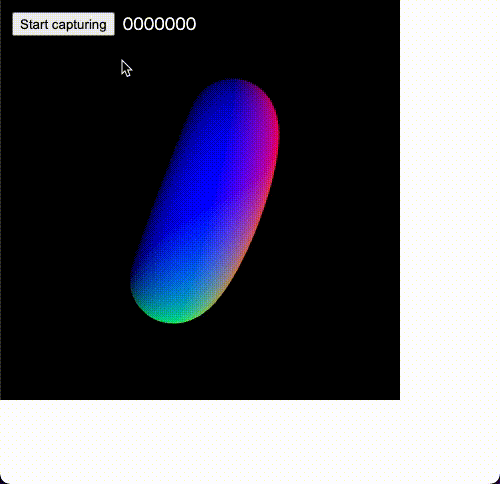

# p5.save-frames

p5.js extension for capturing asequence of frames


## Demo

https://openprocessing.org/sketch/1481891

## Why p5.save-frames?

p5.save-frames is similar to the built-in [`saveFrames`](https://p5js.org/reference/#/p5/saveFrames) function in that it captures a sequence of frames.
This can be useful for creating a movie offline using tools such as ffmpeg.

However, the `saveFrames` function has some limitations:

- Need to edit the code to save the frames
- Need to specify the duration beforehand
- Duration is limited to 15 seconds
- Image files will be downloaded individually

p5.save-frames has the following features:

- No need to add any code to your JavaScript file
- GUI to control the start and stop of the capture
- No duration limitation
- Zip file download

Thus, you can easily add the ability to save frames to your sketches.

## Installation

### CDN

[jsDelivr](https://www.jsdelivr.com/package/npm/p5.save-frames) is available.  
Add the script to your HTML file.

```html
<script src="https://cdn.jsdelivr.net/npm/p5.save-frames@latest/dist/p5.save-frames.umd.min.js"></script>
```

You can also use the fixed version.

```html
<script src="https://cdn.jsdelivr.net/npm/p5.save-frames@2.0.0/dist/p5.save-frames.umd.min.js"></script>
```

## Usage

1. When the script is loaded, the GUI will appear in the upper left corner of the screen
2. Press the button to start capturing
3. Press the button again to stop capturing

That's it.  
A sequence of frames will be downloaded as a zip file.

### Control programmatically

The following functions can be used to programmatically control the capture.

| Functions          | Description                                                             |
| ------------------ | ----------------------------------------------------------------------- |
| `startCapturing()` | Start capturing                                                         |
| `stopCapturing()`  | Stop capturing                                                          |
| `isCapturing()`    | Returns a boolean indicating whether a capture is currently in progress |

```js
function setup() {
  createCanvas(400, 400, WEBGL);
}

function draw() {
  background(0);
  normalMaterial();
  rotateX(frameCount * 0.02);
  rotateY(frameCount * 0.03);
  torus(width * 0.2, width * 0.1, 64, 64);
}

function mouseClicked() {
  if (isCapturing()) {
    stopCapturing();
  } else {
    startCapturing();
  }
}
```

### Async mode

By default, p5.save-frames runs the capture task in sync with the rendering frame rate of p5.js.
In async mode, it will periodically run the capture task asynchronously with the rendering frame rate.
This is useful if you want to set the rendering frame rate and capturing frame rate separately.

Here is an example of using async mode.

```js
P5_SAVE_FRAMES_MODE = "async";

function setup() {
  createCanvas(400, 400, WEBGL);
}

function draw() {
  background(0);
  normalMaterial();
  rotateX(frameCount * 0.02);
  rotateY(frameCount * 0.03);
  torus(width * 0.2, width * 0.1, 64, 64);
}
```

## Configuration

You can change the behavior by specifying some global variables.

| Variables                           | Default         | Description                                                                                      |
| ----------------------------------- | --------------- | ------------------------------------------------------------------------------------------------ |
| `P5_SAVE_FRAMES_MODE`               | `"sync"`        | Execution mode of the capture task. "sync" or "async"                                            |
| `P5_SAVE_FRAMES_OVERRIDE_FRAMERATE` | `false`         | Override the rendering frame rate of p5.js with `P5_SAVE_FRAMES_FRAMERATE`                       |
| `P5_SAVE_FRAMES_FRAMERATE`          | `30`            | Capturing frame rate. Used in async mode or with the `P5_SAVE_FRAMES_OVERRIDE_FRAMERATE` option. |
| `P5_SAVE_FRAMES_EXTENSION`          | `"png"`         | Image format. "png" or "jpg"                                                                     |
| `P5_SAVE_FRAMES_UI_PARENT`          | `document.body` | Parent element to overlay the GUI                                                                |

## Limitations

p5.save-frames currently only supports [p5.js global mode](https://github.com/processing/p5.js/wiki/Global-and-instance-mode).

## License

MIT. Copyright (c) tapioca24
